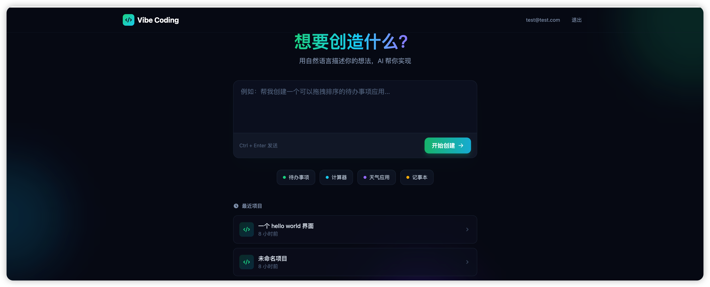
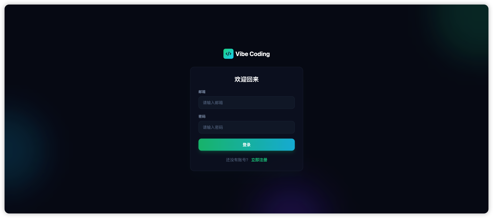
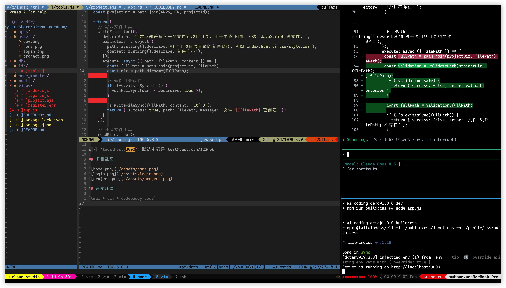

# Vibe Coding Demo

基于 GLM 4.7

## 如何运行

去 <https://bigmodel.cn/usercenter/proj-mgmt/apikeys> 获取 GLM API Key

```
git clone https://github.com/zidoshare/vibe-coding-demo.git
cd vibe-coding-demo
npm install
npm run dev
```

访问 `localhost:3000`，默认密码是 test@test.com/123456

## 说明
### 实现思路

1. 最简设计：express + ejs + sqlite，最小依赖，无负担本地部署
2. 最小化 tool 集：列出文件、获取文件内容、写入文件内容、删除文件，search replace（待实现）
3. 安全：生成纯前端静态页面，无后端执行，所有 tool 防止路径穿越。

相应的，摒弃了复杂工程，可用于快速原型设计

### 完成程度

实现了最简单的注册、登录、项目管理、vibe coding 全链路，vibe coding 走传统的 serverless 路线，每个项目可被静态伺服。

目前只支持单服务器。

### 后续计划

1. 支持 search replace 工具，减少 token 消耗，支持批量替换
2. 对话历史上下文，需要加上，历史可以考虑放服务端+缓存。同步的还需要加上上下文压缩能力
3. 考虑到纯静态界面，可以实现无状态，考虑文件读写都读写数据库，伺服器也转数据库就好
4. 支持项目预览权限，现在所有项目都是公开的，可以通过 gateway 拿 cookie 进行鉴权。
5. 预制一些 CDN 比如 tailwindcss 给到 system prompt
6. 预览加载态
7. 支持联网检索，可以做些 research 工作
8. 支持 cloud use，安全调用外部 API，写个 proxy 拉取用户 API KEY 填到请求头里，安全，不暴露给 AI 
9. 支持其他模型

## 项目截图





## 开发环境

`tmux + vim + codebuddy code`


